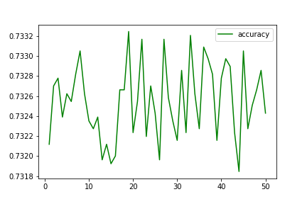
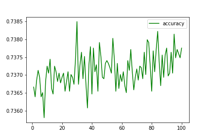
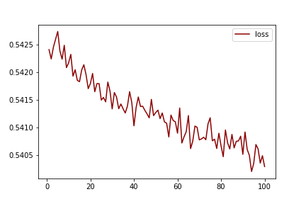
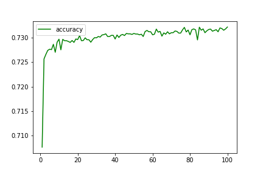
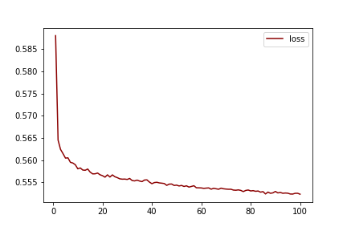
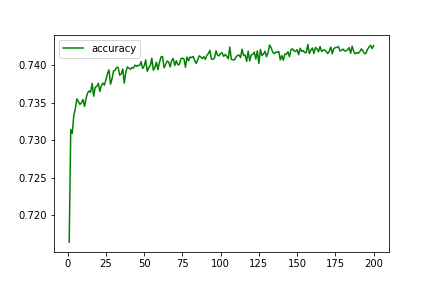
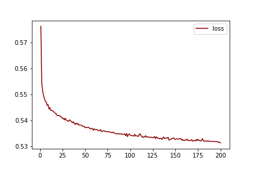

# Deep Learning Challenge

In this project, the nonprofit foundation Alphabet Soup wants a tool that can help it select the applicants for funding with the best chance of success in their ventures. The dataset contains more than 34,000 organisations that have received funding from Alphabet Soup over the years. Within this dataset are a number of columns that capture metadata about each organisation. The aim is to use machine learning to pradict which attributes will make a successful application.

## Initial Data

Following the instructed preprocessing my initial model resulted in 72.26% accuracy and the model was fairly variable as it was processing the data

**Training Results - Loss: 0.5571815371513367, Accuracy: 0.7226822376251221**

## Optimisation V1

For this I removed the ASK AMOUNT column as it had a lot of variablity and I thought it would make the learning more difficult. I also added NN units and increased the number of epochs to 100 as my initial choices seemed to be lacking for the amount of data. In the end the accuracy fell compared to the previous model

**Training Results - Loss: 0.5563463568687439, Accuracy: 0.7223323583602905**

## Optimisation V2

Because the previous model fell in its accuracy which I think is due to removing the ASK AMOUNT I put it back in and instead removed the INCOME_AMT coloumn as more than half are 0 responses. I also added a third hidden layer and changed the method for one layers to see the results. This was the worst result yet which tells me the INCOME_AMT was useful

**Training Results - Loss: 0.5644083619117737, Accuracy: 0.7181341052055359**

## Optimisation V3

In this version I put back the INCOME_AMT and I binned the AFFILIATION category and increased the number of epochs. It did result in the best accuracy yet however it is still under the 75% goal

**Training Results - Loss: 0.5576176047325134, Accuracy: 0.7252478003501892**

